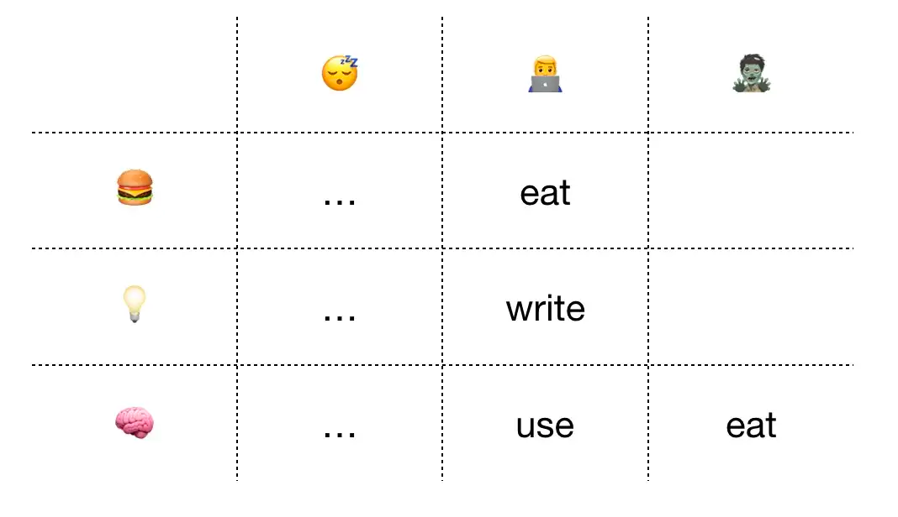
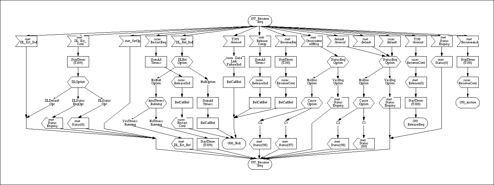

<div align="center">
  <h1>🤖 Faste 💡</h1>
  TypeScript centric Table Finite State Machine
  <br/>
  
  <br/>
  <br/>
  <a href="https://circleci.com/gh/theKashey/faste/tree/master">
     
  </a>

  <a href="https://codecov.io/github/thekashey/faste">
   
  </a>

  <a href="https://www.npmjs.com/package/faste">
   
  </a>

  <a href="https://greenkeeper.io/">
   
  </a>

  <br/>
  <br/>
  <br/>  
</div>

> no dependencies, in around 2kb

- 👨‍🔬 a bit less state-ish than [xstate](https://xstate.js.org/docs/)
- 🤖 way more state-full than anything else in your code
- 🧠 made for everything in between
- 🖥 it does not have Visualizer, but it's VERY TypeScript centric

State machine is a blackbox you can 1) `.start` 2) `.put` some events in and 3) _observe_ how its working.

Internally it will be a machine working in different "states", which called **phases** here (water/ice) recieving
different events and doing something...

Core concepts are:

- phases: different modes your machine can be in
- state: internal state machine sets and controls itself
- attributes: external configuration of machine
- messages: events it can receive from the outside or send to itself
- signals: events it can send to the outer world
- timers: in a very declarative form
- hooks: callbacks which are executed when machine start or stop handling a given message
- guards and traps: protectors from entering or leaving some states

> In react world `attributes` are `props`. In xstate world `state` is `context`

# State machine

State machine _starts_ in one phase, calls _hooks_ for all _messages_ for the current phase,
then _awaits_ for a _messages_ from hooks or external customer, then
could _trigger_ a new message, _emit_ signal to the outer world or _change_ the current phase.

Faste is a black box - you can _put_ message inside, and wait for a _signal_ it will sent outside, meanwhile
observing a box _phase_. Black📦 == Component🎁.

📖 Read an article about [FASTE, and when to use it](https://medium.com/@antonkorzunov/fasten-your-state-9fb9f9b44f30).

# Example

```js
const light = faste()
  // define possible "phases" of a traffic light
  .withPhases(['red', 'yellow', 'green'])
  // define possible transitions from one phase to another
  .withTransitions({
    green: ['yellow'],
    yellow: ['red'],
    red: ['green'],
  })
  // define possible events for a machine
  .withMessages(['switch'])
  .on('switch', ['green'], ({ transitTo }) => transitTo('yellow'))
  .on('switch', ['yellow'], ({ transitTo }) => transitTo('red'))
  .on('switch', ['red'], ({ transitTo }) => transitTo('green'))
  // ⚠️ the following line would throw an error at _compile time_
  .on('switch', ['green'], ({ transitTo }) => transitTo('red')) // this transition is blocked

  // block transition TO green if any pedestrian is on the road
  .guard(['green'], () => noPedestriansOnTheRoad)
  // block transition FROM red if any pedestrian is on the road
  .trap(['red'], () => !noPedestriansOnTheRoad);
// PS: noPedestriansOnTheRoad could be read from attr, passed from a higher state machine.
```

# API

## Machine blueprint

`faste(options)` - defines a new faste machine
every faste instance provide next _chainable_ commands

- `on(eventName, [phases], callback)` - set a hook `callback` for `eventName` message in states `states`.
- `hooks(hooks)` - set a hook when some message begins, or ends its presence.

- `guard(phases, callback)` - add a transition guard, prevention transition to the phase
- `trap(phases, callback)` - add a transition guard, prevention transition from the phase

In development mode, and for typed languages you could use next commands

- `withState(state)` - set a initial state (use @init hook to derive state from props).
- `withPhases(phases)` - limit phases to provided set.
- `withTimers(timersConfuguration)` - configures timers
- `withTransitions([phases]:[phases])` - limit phase transitions
- `withMessages(messages)` - limit messages to provided set.
- `withAttrs(attributes)` - limit attributes to provided set.
- `withSignals(signals)` - limit signals to provided set.
-
- `withMessageArguments<MessageConfiguration>()` - enabled arguments for messages
- `withSignalArguments<SignalConfiguration>()` - enabled arguments for signals

- `create()` - creates a machine (copies existing, use it instead of `new`).

All methods returns a `faste` constructor itself.

## Machine instance

Each instance of Faste will have:

- `attrs(attrs)` - set attributes.
- `put` - put message in
- `connect` - connects output to the destination
- `observe` - observes phase changes

- `phase` - returns the current phase
- `instance` - returns the current internal state.

- `destroy` - exits the current state, terminates all hooks, and stops machine.

- `namedBy(string)` - sets name of the instance (for debug).

For all callbacks the first argument is `flow` instance, containing.

- `attrs` - all the attrs, you cannot change them

- `state` - internal state
- `setState` - internal state change command

- `phase` - current phase
- `transitTo` - phase change command.

- `startTimer(timerName)` - starts a Timer
- `stopTimer(timerName)` - stops a Timer

- `emit` - emits a message to the outer world

### Magic events

- `@init` - on initialization
- `@enter` - on phase enter, last phase will be passed as a second arg.
- `@leave` - on phase enter, new phase will be passed as a second arg.
- `@change` - on state change, old state will be passed as a second arg.
- `@miss` - on event without handler
- `@error` - an error handler. If no errors handler will be found the real error will be thrown

### Magic phases

- `@current` - set the same phase as it was on the handler entry
- `@busy` - set the _busy_ phase, when no other handler could be called

### Hooks

Hook activates when message starts or ends it existence, ie when there is `on` callback defined for it.

### Event bus

- message handler could change phase, state and trigger a new message
- hook could change state or trigger a new message, but not change phase
- external consumer could only trigger a new message

## InternalState

Each `on` or `hook` handler will receive `internalState` as a first argument, with following shape

```js
 attrs: { ...
    AttributesYouSet
}
;  // attributes
state: { ..
    CurrentState
}
;       // state

setState(newState);              // setState (as seen in React)

transitTo(phase);                // move to a new phase

emit(message, ...args);          // emit Signal to the outer world (connected)

trigger(event, ...args);         // trigger own message handler (dispatch an internal action)
```

# Debug

Debug mode is integrated into Faste.

```js
import {setFasteDebug} from 'faste'

setFasteDebug(true);
setFasteDebug(true);
setFasteDebug((instance, message, args) => console.log(...));
```

# Examples

Try online : https://codesandbox.io/s/n7kv9081xp

### Using different handlers in different states

```js
// common code - invert the flag
onClick = () => this.setState((state) => ({ enabled: !state.enabled }));

// faste - use different flags for different states
faste()
  .on('click', 'disabled', ({ transitTo }) => transitTo('enabled'))
  .on('click', 'enabled', ({ transitTo }) => transitTo('disabled'));
```

### React to state change

```js
// common code - try to reverse engineer the change
componentDidUpdate(oldProps)
{
    if (oldProps.enabled !== this.props.enabled) {
        if (this.props.enabled) {
            // I was enabled!
        } else {
            // I was disabled!
        }
    }
}

// faste - use "magic" methods
faste()
    .on('@enter', ['disabled'], () => /* i was disabled */)
    .on('@enter', ['enabled'], () => /* i was enabled */)
    // or
    .on('@leave', ['disabled'], () => /* i am no more disabled */)
    .on('@leave', ['enabled'], () => /* i am no more enabled */)
```

### Connected states

https://codesandbox.io/s/5zx8zl91ll

```js
// starts a timer when active
const SignalSource = faste()
  .on('@enter', ['active'], ({ setState, attrs, emit }) =>
    setState({ interval: setInterval(() => emit('message'), attrs.duration) })
  )
  .on('@leave', ['active'], ({ state }) => clearInterval(state.interval));

// responds to "message" by moving from tick to tock
// emiting the current state outside
const TickState = faste()
  // autoinit to "tick" mode
  .on('@init', ({ transitTo }) => transitTo('tick'))
  // message handlers
  .on('message', ['tick'], ({ transitTo }) => transitTo('tock'))
  .on('message', ['tock'], ({ transitTo }) => transitTo('tick'))
  .on('@leave', ({ emit }, newPhase) => emit('currentState', newPhase));

// just transfer message to attached node
const DisplayState = faste().on('currentState', ({ attrs }, message) => (attrs.node.innerHTML = message));

// create machines
const signalSource = SignalSource.create().attrs({
  duration: 1000,
});
const tickState = TickState.create();
const displayState = DisplayState.create().attrs({
  node: document.querySelector('.display'),
});

// direct connect signal source and ticker
signalSource.connect(tickState);

// "functionaly" connect tickes and display
tickState.connect((message, payload) => displayState.put(message, payload));

// RUN! start signal in active mode
signalSource.start('active');
```

### Traffic light

```js
const state = faste()
  .withPhases(['red', 'yellow', 'green'])
  .withMessages(['tick', 'next'])

  .on('tick', ['green'], ({ transit }) => transit('yellow'))
  .on('tick', ['yellow'], ({ transit }) => transit('red'))
  .on('tick', ['red'], ({ transit }) => transit('green'))

  // on 'next' trigger 'tick' for a better debugging.
  // just rethrow event
  .on('next', [], ({ trigger }) => trigger('tick'))

  // on "green" - start timer
  .on('@enter', ['green'], ({ setState, attrs, trigger }) =>
    setState({
      interval: setInterval(() => trigger('next'), attrs.duration),
    })
  )
  // on "red" - stop timer
  .on('@leave', ['red'], ({ state }) => clearInterval(state.interval))

  .check();

state.create().attrs({ duration: 1000 }).start('green');
```

Try online : https://codesandbox.io/s/n7kv9081xp

### Draggable

```js
const domHook =
  (eventName) =>
  ({ attrs, trigger }) => {
    const callback = (event) => trigger(eventName, event);
    attrs.node.addEventListener(eventName, callback);
    // "hook" could return anything, callback for example
    return () => {
      attrs.node.removeEventListener(eventName, hook);
    };
  };

const state = faste({})
  .on('@enter', ['active'], ({ emit }) => emit('start'))
  .on('@leave', ['active'], ({ emit }) => emit('end'))

  .on('mousedown', ['idle'], ({ transitTo }) => transitTo('active'))
  .on('mousemove', ['active'], (_, event) => emit('move', event))
  .on('mouseup', ['active'], ({ transitTo }) => transitTo('idle'));

hooks({
  mousedown: domHook('mousedown'),
  mousemove: domHook('mousemove'),
  mouseup: domHook('mouseup'),
})
  .check()

  .attr({ node: document.body })
  .start('idle');
```

# Async

Message handler doesn't have to be sync. But managing async commands could be hard. But will not

1. Accept command only in initial state, then transit to temporal state to prevent other commands to be executes.

```js
const Login = faste().on('login', ['idle'], ({ transitTo }, { userName, password }) => {
  transitTo('logging-in'); // just transit to "other" state
  login(userName, password)
    .then(() => transitTo('logged'))
    .catch(() => transitTo('error'));
});
```

2. Accept command only in initial state, then transit to execution state, and do the job on state enter

```js
const Login = faste()
    .on('login', ['idle'], ({transitTo}, data) => transitTo('logging', data)
        .on('@enter', ['logging'], ({transitTo}, {userName, password}) => {
            login(userName, password)
                .then(() => transitTo('logged'))
                .catch(() => transitTo('error'))
        });
```

2. Always accept command, but be "busy" while doing stuff

```js
const Login = faste().on('login', ({ transitTo }, { userName, password }) => {
  transitTo('@busy'); // we are "busy"
  return login(userName, password)
    .then(() => transitTo('logged'))
    .catch(() => transitTo('error'));
});
```

> handler returns Promise( could be async ) to indicate that ending in @busy state is not a mistake, and will not lead
> to deadlock.

By default `@busy` will queue messages, executing them after leaving busy phase.
If want to ignore them - instead of `@busy`, you might use `@locked` phase, which will ignore them.

PS: You probably will never need those states.

## Using timers to create timers

Plain variant

```tsx
const SignalSource = faste()
  .on('@enter', ['active'], ({ setState, attrs, emit }) =>
    setState({ interval: setInterval(() => emit('message'), attrs.duration) })
  )
  .on('@leave', ['active'], ({ state }) => clearInterval(state.interval));
```

Hook and timer based

```tsx
const SignalSource = faste()
  .on('tick', ['active'], ({ emit, startTimer }) => {
    emit('message');
  })
  .hook({
    tick: ({ attrs }) => {
      const interval = setInterval(() => emit('message'), attrs.duration);
      return () => clearInterval(interval);
    },
  });
```

Hook and timer based

```tsx
const SignalSource = faste()
  .withTimers({
    T0: 1000,
  })
  .on('on_T0', ({ emit, startTimer }) => {
    emit('message');
    startTimer('T0'); //restarts timers
  })
  .on('@enter', ['active'], ({ startTimer }) => startTimer('T0'));
```

# SDL and Block

Faste was born from this. From Q.931(EDSS) state definition.

How it starts. What signals it accepts. What it does next.



That is quite simple diagram.

## Thoughts

This is a Finite State Machine from
SDL([Specification and Description Language](https://en.wikipedia.org/wiki/Specification_and_Description_Language))
prospective.
SDL defines state as a set of messages, it should react on, and the actions beneath.

Once `state` receives a `message` it executes an `action`, which could perform calculations and/or change the
current state.

> The goal is not to **change the state**, but - **execute a bound action**.
> From this prospective faste is closer to RxJX.

Usually "FSM" are more focused on state transitions, often even omitting any operations on message receive.
In the Traffic Light example it could be useful, but in more real life examples - probably not.

Faste is more about _when_ you will be able to do _what_. **What** you will do, **when** you receive event, and what you
will do next.

Keeping in mind the best practices, like KISS and DRY, it is better to invert state->message->action connection,
as long as actions are most complex part of it, and messages are usually reused across different states.

And, make things more common we will call "state" as a "phase", and "state" will be for "internal state".

The key idea is not about transition between states, but transition between behaviors.
Keep in mind - if some handler is not defined in some state, and you are sending a message - it will be **lost**.

> Written in TypeScript. To make things less flexible. Flow definitions as incomplete.

# Prior art

This library combines ideas from [xstate](https://github.com/davidkpiano/xstate)
and [redux-saga](https://github.com/redux-saga/redux-saga).
The original idea is based on [xflow](https://gist.github.com/theKashey/93f10d036961f4bd7dd728153bc4bea9) state machine,
developed for [CT Company](http://www.ctcom.com.tw)'s VoIP solutions back in 2005.

# Licence

MIT
